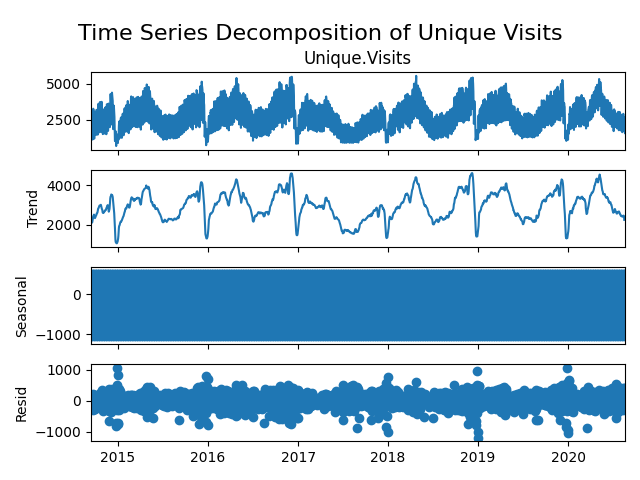
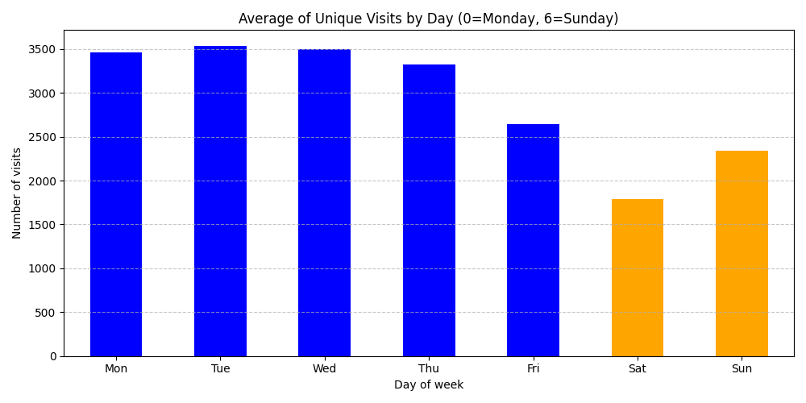
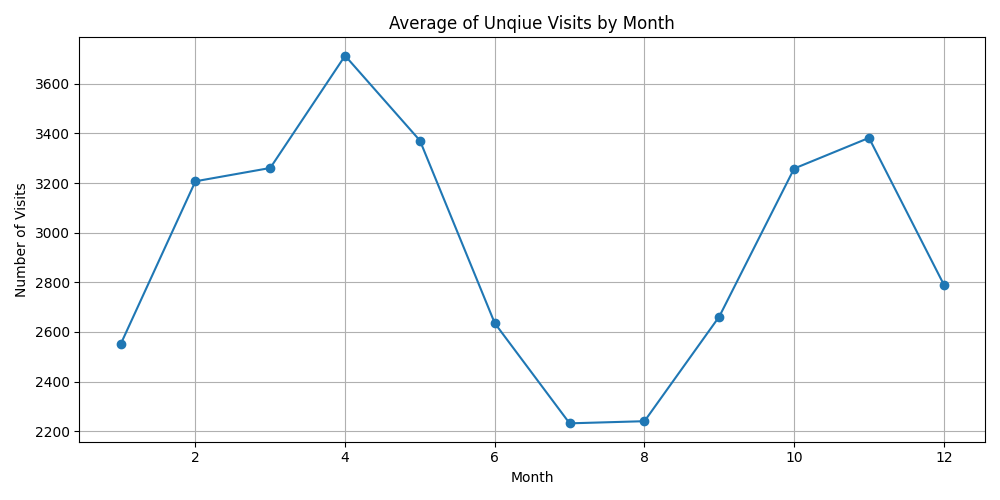
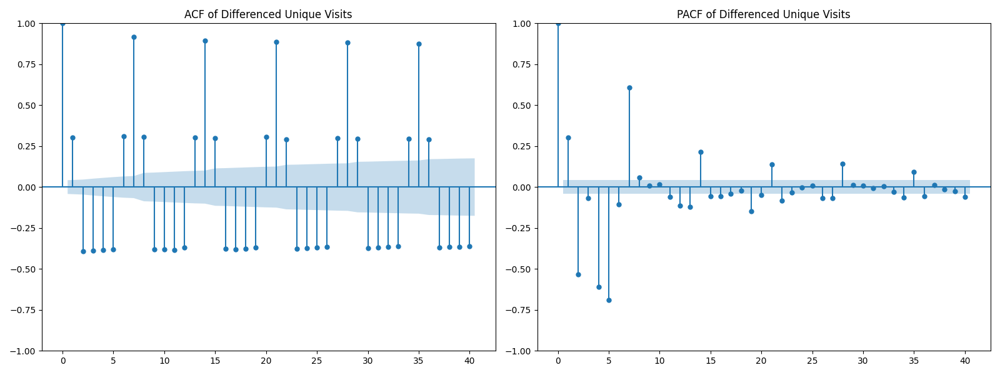
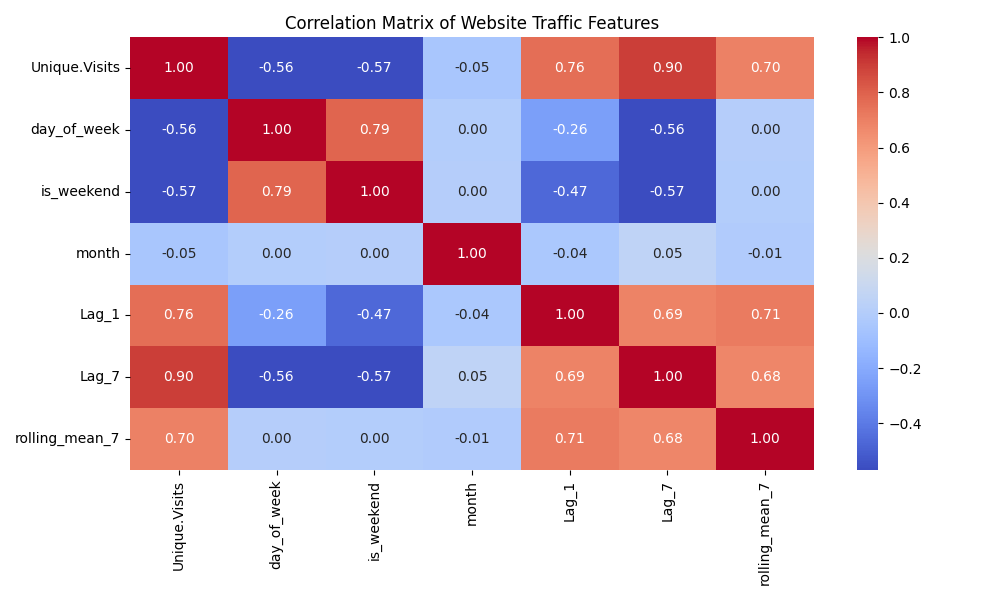
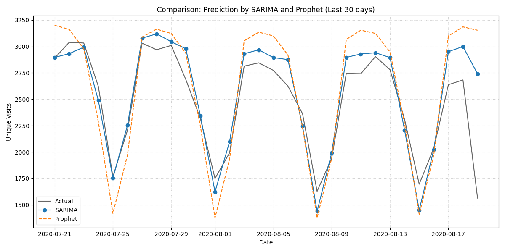

# 📈 Website Visitors Forecasting: SARIMA Model vs Prophet Model

## 📌 1. Tổng quan dự án
Dự án này tập trung vào việc nghiên cứu và xây dựng hệ thống dự báo lưu lượng truy cập (Unique Visits) hàng ngày cho website. Thay vì chỉ sử dụng các mô hình dự báo cơ bản, dự án đi sâu vào việc giải quyết các thách thức đặc thù của chuỗi thời gian như tính mùa mạnh (Weekly Seasonality), xu hướng (Trend) và tác động của các yếu tố ngoại vi thông qua mô hình SARIMAX và Facebook Prophet.

## 🛠 2. Công cụ và Công nghệ
* **Ngôn ngữ:** Python
* **Thư viện chính:**
    * `Statsmodels`: Triển khai mô hình SARIMAX phức hợp.
    * `Prophet`: Mô hình dự báo hiện đại từ Meta.
    * `Scikit-learn`: Đánh giá sai số và kiểm chứng chéo (TSCV).
    * `Pandas`, `Matplotlib`, `Seaborn`: Xử lý và trực quan hóa dữ liệu.

## 📊 3. Quy trình thực hiện (Workflow)

### 3.1. Thu thập và Tiền xử lý dữ liệu
* Làm sạch dữ liệu gốc, xử lý định dạng số (loại bỏ dấu phẩy) và chuyển đổi về dạng `int`.
* Thiết lập tần suất chuỗi thời gian hàng ngày (`asfreq('D')`) để đảm bảo tính liên tục, không có khoảng trống dữ liệu.

### 3.2. Khám phá dữ liệu (EDA)
**Time Series Decomposition:** Bóc tách chuỗi dữ liệu thành: Xu hướng (Trend), Mùa (Seasonality - chu kỳ 7 ngày) và Phần dư (Residuals).

**Phân tích tính mùa (Seasonality)**
* **Theo ngày trong tuần:** Lượt truy cập cao nhất vào các ngày làm việc (T2-T6) và giảm mạnh vào cuối tuần.

* **Theo tháng:** Giúp nhận diện các giai đoạn cao điểm trong năm.

**Kiểm định tính dừng (ADF Test):** Kiểm định ADF cho thấy dữ liệu gốc không đạt tính dừng ($P-value > 0.05$) do có xu hướng tăng trưởng. Sau khi áp dụng Sai phân bậc 1 (d=1), chuỗi dữ liệu đã đạt trạng thái dừng, cho phép các thành phần Tự hồi quy (AR) và Trung bình trượt (MA) hoạt động chính xác trên các dao động thực tế của Website.

**ACF & PACF:** Phân tích biểu đồ tự tương quan để xác định các tham số ban đầu (p, d, q).

**Phân tích tương quan (Correlation Analysis):** Để xác định các điều kiện tốt nhất cho mô hình dự báo, một biểu đồ tương quan đã được xây dựng giữa biến mục tiêu `Unique.Visits` và các biến trễ, biến xu hướng.

**Phân tích chi tiết:**
* Tương quan với `Lag_7` (0.91): Đây là chỉ số quan trọng nhất. Mức tương quan dương gần như tuyệt đối (0.91) khẳng định rằng lưu lượng truy cập của 7 ngày trước là yếu tố dự báo tốt nhất cho ngày hiện tại. Điều này củng cố việc thiết lập tham số mùa S=7 trong mô hình SARIMA.
* Tương quan với `Rolling_Mean_7` (0.85): Chỉ số này cho thấy xu hướng ngắn hạn của tuần có ảnh hưởng rất lớn đến giá trị thực tế của ngày tiếp theo.
* Mối quan hệ nội tại: Các biến như `Page.Loads` và `First.Time.Visits` cũng có tương quan rất cao, tuy nhiên để tránh hiện tượng đa cộng tuyến (Multicollinearity) và đảm bảo tính thực tế của bài toán dự báo, chúng ta tập trung vào các biến trễ thời gian.

### 3.3. Feature Engineering (Đặc trưng kỹ thuật)
Tạo ra các biến ngoại sinh (Exogenous) để dẫn dắt mô hình:
* **Lag_7:** Giá trị lượt truy cập của đúng 7 ngày trước (tín hiệu mùa vụ tuần mạnh nhất).
* **Rolling_Mean_7:** Trung bình trượt 7 ngày để nắm bắt xu hướng ngắn hạn và khử nhiễu.
* **Time-based features:** Ngày trong tuần, tháng, và biến nhị phân `is_weekend`.

## 🧪 4. Mô hình hóa và Giải thích tham số

Dự án sử dụng mô hình **SARIMAX(1, 1, 1)x(1, 1, 1, 7)** kết hợp biến ngoại sinh.

### 4.1. Giải thích các con số trong mô hình
Các con số này không ngẫu nhiên mà là kết quả của quá trình tối ưu hóa toán học:
* **Hệ số (Coefficients):** Được xác định bằng phương pháp **Maximum Likelihood Estimation (MLE)**. Ví dụ: Hệ số dương của `rolling_mean_7` cho thấy khi xu hướng chung tăng, dự báo ngày mai sẽ tăng theo tỷ lệ tương ứng.
* **P-value:** Tất cả các biến được chọn đều có $P < 0.05$, khẳng định chúng có ý nghĩa thống kê, không phải do trùng hợp ngẫu nhiên.
* **AIC (Akaike Information Criterion):** Dùng để chọn lọc mô hình cân bằng nhất giữa độ khớp và sự đơn giản (tránh Overfitting).

## 📊 5. Đánh giá chuyên sâu (Evaluation)

### 5.1. Kết quả Kiểm chứng chéo (Time Series Cross-Validation - TSCV)
Sử dụng **Rolling Window** với 5 Folds (mỗi Fold kiểm tra 30 ngày) để đảm bảo tính ổn định bền vững:

| Fold | MAE | MAPE (%) | R-Squared ($R^2$) | RMSE |
| :--- | :---: | :---: | :---: | :---: |
| **Fold 1** | 131.11 | 3.81% | 0.9201 | 11.4504 |
| **Fold 2** | 162.99 | 3.85% | 0.8927 | 12.7668 |
| **Fold 3** | 194.48 | 6.10% | 0.8136 | 13.9457 | 
| **Fold 4** | 204.87 | 7.65% | 0.7311 | 14.3132 |
| **Fold 5** | 158.53 | 7.44% | 0.6877 | 12.5907 |
| **Trung bình** | **170.40** | **5.77%** | **0.8091** | **13.0134** |

> **Nhận xét:** MAPE trung bình **5.77%** và $R^2$ trung bình **0.8091** là minh chứng cho một mô hình có độ tin cậy và tính tổng quát hóa cực cao.

### 5.2. So sánh (SARIMA vs Prophet)
Đánh giá trên 30 ngày cuối cùng (tập Test cố định):

| Chỉ số | SARIMA | Prophet |
| :--- | :---: | :---: |
| **MAE** | **158.5** | 270.7 |
| **MAPE** | **7.44%** | 12.37% |
| **R-Squared** | **0.6877** | 0.3153 |
| **RMSE** | **261.9** | 387.8 |

**Tại sao SARIMA vượt trội?** SARIMA sử dụng `Lag_7` làm "mỏ neo" thực tế, giúp bắt kịp các biến động răng cưa chính xác hơn so với cơ chế mượt hóa đường cong của Prophet.

## 💡 6. Kết luận & Insights
1.  **Tính kỷ luật của dữ liệu:** Traffic website có tính chu kỳ tuần rất mạnh (T2-T6 cao, cuối tuần thấp), phản ánh đối tượng người dùng chuyên nghiệp/học thuật.
2.  **Sức mạnh của biến ngoại sinh:** Việc tích hợp `Lag_7` và `Rolling_Mean_7` giúp giảm sai số đáng kể so với các mô hình chỉ dựa trên giá trị tự hồi quy đơn thuần.
3.  **Độ ổn định:** Qua TSCV, mô hình chứng minh được khả năng vận hành tốt trên nhiều giai đoạn thời gian khác nhau, sẵn sàng để ứng dụng vào thực tế.

## 🚀 Cách chạy dự án
Để chạy dự án này trên máy tính của bạn, hãy thực hiện theo các bước sau:
1. **Clone dự án:** git clone https://github.com/TranKhoa895/Website-Visitors-Forecasting.git

2. **Cài đặt thư viện:** 
Bạn nên sử dụng môi trường ảo (venv) để tránh xung đột thư viện:

    pip install pandas numpy matplotlib seaborn statsmodels scikit-learn prophet 

3. **Chuẩn bị dữ liệu:**
Đảm bảo file dữ liệu daily-website-visitors.csv đã nằm trong thư mục gốc của dự án để mô hình có thể truy xuất dữ liệu lịch sử.

4. **Chạy file:**
    python website_forecast.py

5. **Kiểm tra kết quả:**
* Sau khi chạy, chương trình sẽ thực hiện huấn luyện SARIMAX, Prophet và thực hiện Kiểm chứng chéo (TSCV). Các file báo cáo và hình ảnh sau sẽ tự động được tạo ra:

    * daily_visits.png: Biểu đồ diễn biến lưu lượng truy cập thực tế theo thời gian.

    * time_series_decomposition.png: Biểu đồ bóc tách các thành phần Xu hướng và Mùa vụ.

    * correlation_heatmap.png: Ma trận tương quan xác định sức mạnh của các biến trễ (Lag_7).

    * acf_pacf_plots.png: Biểu đồ tự tương quan dùng để xác định tham số mô hình.

    * comparison_sarima_prophet.png: Biểu đồ so sánh trực quan hiệu suất dự báo giữa hai mô hình trên 30 ngày cuối.
